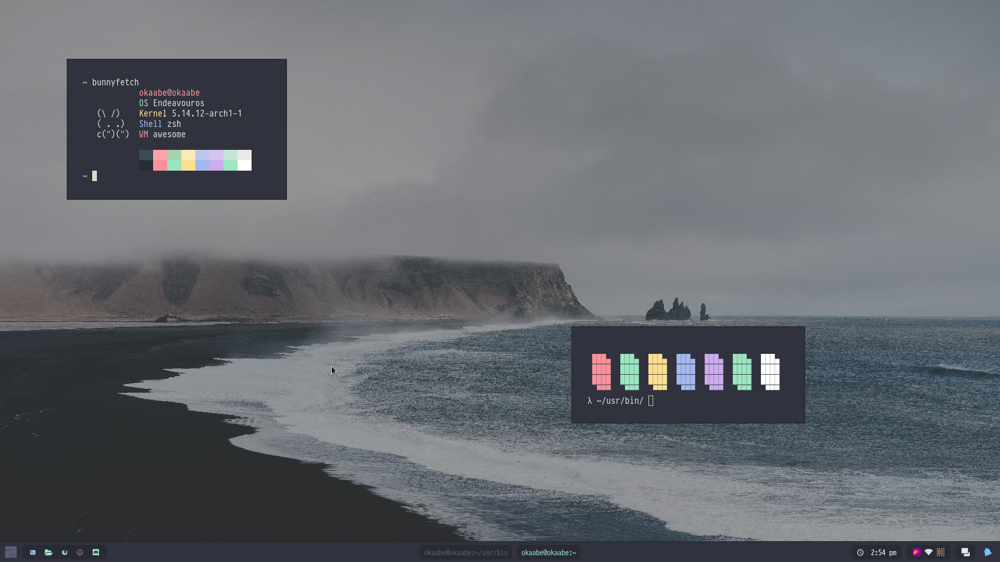
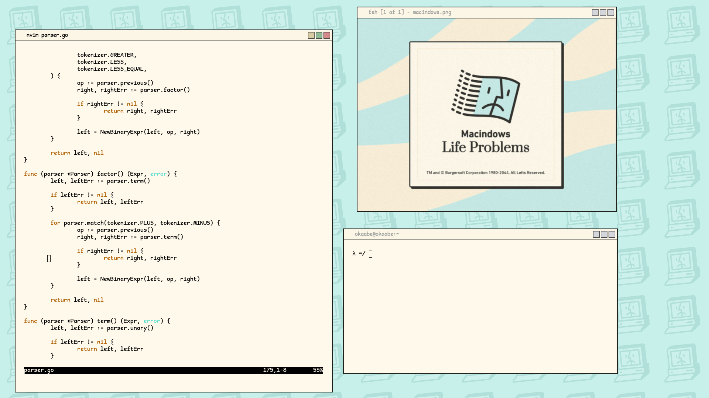

Welcome to my awesomewm configuration, i have tried to make a readable config since the default one is not bad, but it's kinda a mess in my opnion... There are here some attempts to clone anotehr ricings that i found in <a href="http://reddit.com/r/unixporn">r/unixporn</a>. 

**Note**: Please don't use this as your daily setup - I just stared to use awesomewm few time ago, so i don't know exactly what im doing here.

## AwesomeWM Modules
### [bling](https://github.com/BlingCorp/bling)
- Adds new layouts, modules, and widgets that try to primarily focus on window management

## AwesomeWM themes
**Note:** The design of the themes (bar, titlebar assets...) weren't created by me, i have took them from javacafe's ricings (the ghost pallete i have been jumping betweem the new pallete and the old one, so i don't know...) and the macindows theme is just an attempt to implement the macindows dedsign that i have found in the google (if im not mistaken there is also a implementation of it on unixporn)

### Ghosts

### Macindows

